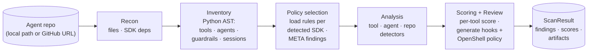

# trustabl

Static analyzer for agent reliability. Scans an agent SDK repo (Claude Agent
SDK, OpenAI Agents SDK, MCP), finds reliability and safety weaknesses, emits
committable artifacts (Pre/PostToolUse hook configs + a defaults-only
OpenShell sandbox-policy starter).

OpenShell-related code is still discovered (shell-invocation surfaces,
`openshell/*.yaml` sandbox policies, `openshell` deps), but the OSH-* rule
pack that previously audited it has moved to a closed-source companion
project. Repos that use OpenShell now produce a META-001 info finding
flagging it as an unaudited SDK.

Ships as a single Go binary.



See [ARCHITECTURE.md § 2](ARCHITECTURE.md#2-pipeline) for the full diagram
with typed inputs at each stage.

## Status

The scan pipeline runs end-to-end. Detection runs from YAML rule
files embedded at build time via `go:embed`; see
[ARCHITECTURE.md](ARCHITECTURE.md) for the engine and `internal/rules/policies/`
for the rule definitions.

**Language scope.** Tool discovery is **Python-only** today —
TypeScript / JavaScript / Go files are recognized in the file inventory and
contribute to agent-component discovery (MCP configs, hooks, manifests,
etc.), but no AST parser for those languages is plumbed in, so no tools are
extracted from them. The rule schema's `language:` field is in place for
multi-language rule sets when those parsers ship. See
[ARCHITECTURE.md § 1.1](ARCHITECTURE.md#11-language-scope).

**SDK coverage.** See [Supported SDKs](#supported-sdks-and-adks) below for
the recognized agent SDKs, the decorators and constructor shapes discovery
extracts from each, and the current status of their rule packs. Each SDK's
agents are discovered separately (`kind: openai_agent` vs
`claude_agent_definition`) and checked only against the rules for that SDK
— no cross-SDK casting.

**Test contract.** The `examples/` directory holds real-world agent code
(Claude SDK demos, OpenAI Agents SDK demos, etc.). It is a corpus, not a
controlled fixture — well-written agents won't trigger most rules, and
that's correct. Per-rule fire/silent correctness lives in
[`internal/rules/policies_test.go`](internal/rules/policies_test.go); the
end-to-end sweep in
[`internal/scanner/scanner_test.go`](internal/scanner/scanner_test.go) only
asserts the scanner doesn't crash on real-world inputs.

Scope boundaries, by design:

- **LLM enrichment is opt-in.** `internal/inference/router.go` defines the
  BYOK interface and cache; rule-based detection runs fully without it.
- **Confidence scores are heuristic**, not LLM-judged.
- **Detection-quality benchmark.** A 20–40 real-agent-repo corpus with
  labelled findings is the detection-quality target (see
  [ARCHITECTURE.md §10](ARCHITECTURE.md#10-what-is-intentionally-out));
  the three-layer test strategy in `internal/rules/` and `internal/scanner/`
  is regression coverage, not detection-quality measurement.
- **The CLI is the surface.** No web app, API server, or GitHub Action —
  pipe `--format json` into your own automation.

## Build

CGO is required because the Python AST parser uses tree-sitter:

```bash
# macOS / Linux
CGO_ENABLED=1 go build -o trustabl ./cmd/trustabl

# Cross-compile: pick a C toolchain for the target. zig is the easiest.
CGO_ENABLED=1 CC="zig cc -target x86_64-linux-gnu" \
  GOOS=linux GOARCH=amd64 go build -o trustabl-linux ./cmd/trustabl
```

This is the cost of using tree-sitter for accurate Python parsing. If single-binary,
no-CGO distribution becomes a hard requirement later, swap the parser for
`github.com/go-python/gpython` and accept lower fidelity on modern Python.

## Use

```bash
# Local repo
trustabl scan ./path/to/agent-repo

# GitHub repo (shallow clone to temp dir, removed on exit)
trustabl scan https://github.com/org/repo

# Restrict detectors
trustabl scan ./repo --detectors claude_sdk
trustabl scan ./repo --detectors openai_sdk
trustabl scan ./repo --detectors claude_sdk,openai_sdk

# --detectors openshell is still accepted but selects zero rules
# (the OSH-* pack moved to a closed-source companion project).

# Apply generated artifacts (writes hooks/ and openshell/ into the repo;
# requires --yes or interactive approval)
trustabl scan ./repo --apply --yes

# Export the bundle as a ZIP
trustabl scan ./repo --export bundle.zip

# JSON output (for CI piping)
trustabl scan ./repo --format json
```

Exit codes: `0` = no findings ≥ medium, `1` = findings ≥ medium present, `2` =
scanner error. There is no built-in CI integration — pipe
`--format json` to your own CI logic, or invoke `trustabl scan ./repo` and act
on the exit code.

## Produced artifacts

The generated artifacts get committed to the user's repo:

```
<repo>/
├── hooks/
│   ├── pretooluse_validate.py
│   └── posttooluse_log.py
├── openshell/
│   └── policy.yaml
└── otel/
    └── trace_config.yaml          # planned — not currently generated
```

## Layout

| Architecture node | Code path                                |
| ----------------- | ---------------------------------------- |
| Importer          | `internal/ingestion/importer.go`         |
| Normalizer        | `internal/ingestion/normalizer.go`       |
| Tool Discovery    | `internal/analysis/discovery.go`         |
| Detector runtime  | `internal/analysis/detectors/`           |
| Detector rules    | `internal/rules/policies/<category>/`    |
| Rule engine       | `internal/rules/{schema,loader,evaluator,predicates,rule_detector,embed}.go` |
| Scoring Engine    | `internal/analysis/scoring.go`           |
| Hook Generator    | `internal/generation/hooks.go`           |
| Policy Generator  | `internal/generation/policy.go`          |
| Diff Renderer     | `internal/review/diff.go`                |
| Exporter          | `internal/review/export.go`              |
| Inference Router  | `internal/inference/router.go`           |

## Supported SDKs and ADKs

trustabl recognizes the following agent SDKs / agent development kits by
parsing real code (Python AST via tree-sitter). The shapes listed under
"What discovery extracts" are stable — they describe what the scanner can
*see*. The detection rules that fire against those shapes are a separate,
evolving layer (see [Detection rules](#detection-rules) below).

### Claude Agent SDK (Python)

- **Tool decorators recognized**: `@tool`, `@claude_tool`, `@agent.tool`,
  any decorator containing the string `claude_agent_sdk`.
- **Agent shapes recognized**: `AgentDefinition(...)` constructor calls,
  with every kwarg captured into a typed `KwargTree`. Typed accessors
  (`ClaudeBuiltinTools`, `ClaudeDisallowedTools`, `ClaudePermissionMode`,
  `ClaudeMCPServers`) expose the safety-relevant fields — `tools`,
  `disallowedTools`, `permissionMode`, `mcpServers` — without future
  detector code reaching into the raw tree.
- **Subagents** declared under `.claude/agents/*.md` are parsed into typed
  `SubagentDef` records: YAML frontmatter is decoded for `name`,
  `description`, `model`, and `tools`. Both the comma-string form
  (`tools: Read, Bash`) and the YAML-list form (`tools:\n  - Read`) are
  accepted.
- **`.claude/settings.json`** (and `settings.local.json`) is parsed into
  typed `ClaudeSettings`. The `permissions` block's `allow`/`deny`/`ask`
  lists are decomposed via `ParsePermissionRule` into typed
  `PermissionRule{Tool, Pattern, Raw}` records, using the grammar
  `<Tool>` | `<Tool>(<pattern>)` plus the literal MCP-tool form
  `mcp__<server>__<tool>`. `defaultMode`, `additionalDirectories`, and
  presence flags for `env`/`hooks`/`sandbox` blocks are also surfaced
  (with `"key": null` correctly distinguished from key-absent).

### OpenAI Agents SDK (Python)

- **Tool decorator recognized**: `@function_tool` (with decorator kwargs
  `strict_mode`, `failure_error_function`, etc. captured into
  `ToolDef.Config`).
- **Agent shapes recognized**: `Agent(...)` and `SandboxAgent(...)`
  constructor calls. All kwargs captured into a typed `KwargTree`:
  `instructions`, `model`, `model_settings`, `tools`, `handoffs`,
  `input_guardrails`, `output_guardrails`, `tool_use_behavior`,
  `mcp_servers`, etc.
- **Hosted tools recognized inside `tools=[...]`** — a closed set of 11
  SDK-managed classes from `agents/tool.py`: `WebSearchTool`,
  `FileSearchTool`, `ComputerTool`, `HostedMCPTool`, `CodeInterpreterTool`,
  `ImageGenerationTool`, `LocalShellTool`, `ShellTool`, `ApplyPatchTool`,
  `CustomTool`, `ToolSearchTool`. Each occurrence emits a `HostedToolDef`
  and a `HostedToolRef` edge on the owning agent — separate from regular
  `ToolRef`s, since hosted tools have no function body.
- **MCP servers recognized inside `mcp_servers=[...]`** — the three
  transport classes from `agents/mcp/server.py`: `MCPServerStdio` (stdio),
  `MCPServerSse` (sse), `MCPServerStreamableHttp` (streamable_http). Both
  the inline form (`mcp_servers=[MCPServerStdio(...)]`) and the
  `async with X() as srv:` alias form are resolved to typed `MCPServerDef`
  records.
- **Guardrails**: `@input_guardrail` and `@output_guardrail` decorated
  functions are discovered as a separate inventory and resolved as edges
  from each agent.
- **Sessions**: construction sites of `SQLiteSession`, `RedisSession`,
  `EncryptedSession`, etc. are catalogued.

### Model Context Protocol (MCP, Python)

- **Server registrations recognized**: `@server.tool`, `@mcp.tool`, and
  `.register_tool(...)` calls.
- **Config files recognized**: `mcp.json`, `mcp_servers.json`, and
  `claude_desktop_config.json` are surfaced as `mcp_config` components.

### NVIDIA OpenShell

- **Sandbox policy files recognized**: `openshell/*.yaml` and `*.yml` are
  surfaced as `sandbox_policy` components.
- **Shell-invocation surfaces**: any bare function whose body calls
  `subprocess.*`, `os.system`, or `os.popen` is classified as
  `shell_invocation` in the inventory.
- **No detection rules ship here.** The OSH-* rule pack that previously
  audited these surfaces has moved to a closed-source companion project.
  Repos that contain shell-invocation tools produce a META-001 info
  finding ("trustabl does not currently audit this SDK") rather than
  firing the OSH rules.
- **Policy generator output** is now a defaults-only `openshell/policy.yaml`
  starter — the generator still emits a file, but with no OSH findings to
  shape it, the contents are baseline defaults the user authors against.

### Cross-SDK agent components

Discovery surfaces agent-related artifacts that aren't tied to a specific
SDK: `CLAUDE.md`, `.claude/commands/*.md` (slash commands),
`hooks/*.{py,ts,js,jsx,mjs}`, root-level prompt files, and dependency
manifests (`pyproject.toml`, `requirements.txt`, `Pipfile`, `poetry.lock`,
`package.json`, `go.mod`). Two cross-SDK surfaces are additionally **parsed**
into typed inventory (see the Claude Agent SDK section above):
`.claude/agents/*.md` into `SubagentDef`, and
`.claude/settings.json{,.local.json}` into `ClaudeSettings`.

### ScanResult JSON exposure

The `--format json` output exposes the new inventory at the top level of
`ScanResult`, alongside the existing `tools`/`agents`/`findings` fields:

- `hosted_tools`: `[]HostedToolDef`
- `mcp_servers`: `[]MCPServerDef`
- `subagents`: `[]SubagentDef`
- `claude_settings`: `[]ClaudeSettings`

All four slices are sorted deterministically; the determinism contract is
enforced by `TestScanDeterministic` over `testdata/deterministic-fixture/`.

### Language scope

| Language   | File inventory | Component discovery | Tool/agent AST discovery |
| ---------- | -------------- | ------------------- | ------------------------ |
| Python     | yes            | yes                 | yes                      |
| TypeScript | yes            | yes                 | not yet                  |
| JavaScript | yes            | yes                 | not yet                  |
| Go         | yes            | yes                 | not yet                  |

Only Python is parsed by tree-sitter today. The rule schema's `language:`
field is in place for multi-language rule sets when those parsers ship.

### Detection rules

Rule packs are organized per SDK under
`internal/rules/policies/{claude_sdk,openai_sdk}/<topic>.yaml`,
embedded at build time via `go:embed`. The rule catalog grows as new SDK
patterns are covered; findings have not yet been calibrated against a
labelled real-agent corpus (see [ARCHITECTURE.md §10](ARCHITECTURE.md#10-what-is-intentionally-out)),
so treat them as signal to investigate.

Naming convention: `CSDK-NNN` for Claude Agent SDK, `OAI-NNN` for OpenAI
Agents SDK. (OSH-NNN OpenShell rules previously shipped here; that pack
moved to a closed-source companion project.)
